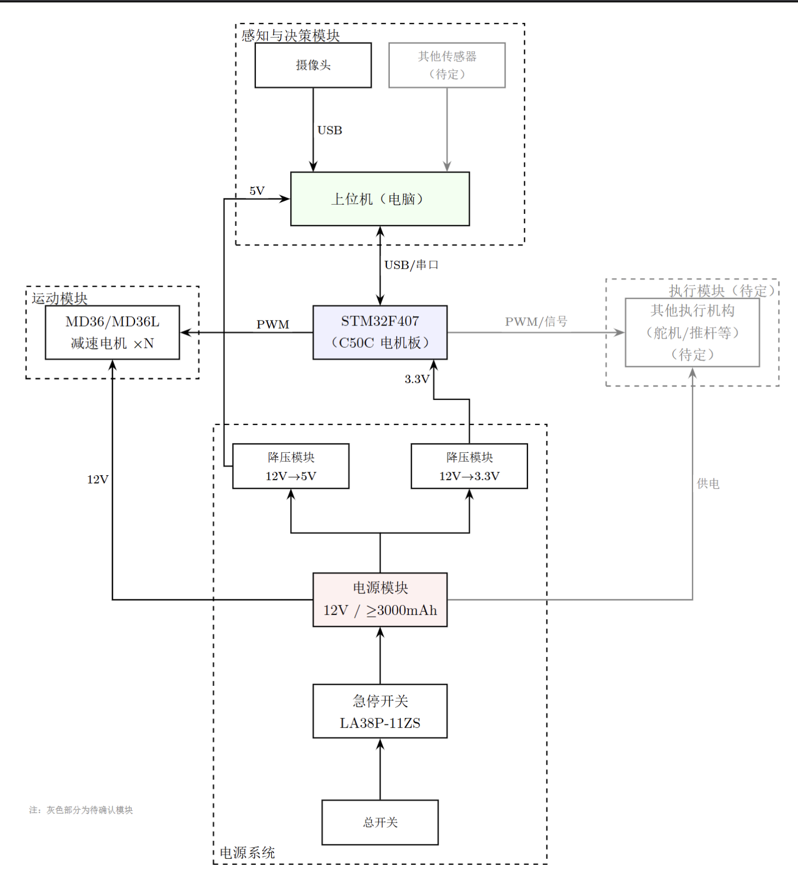
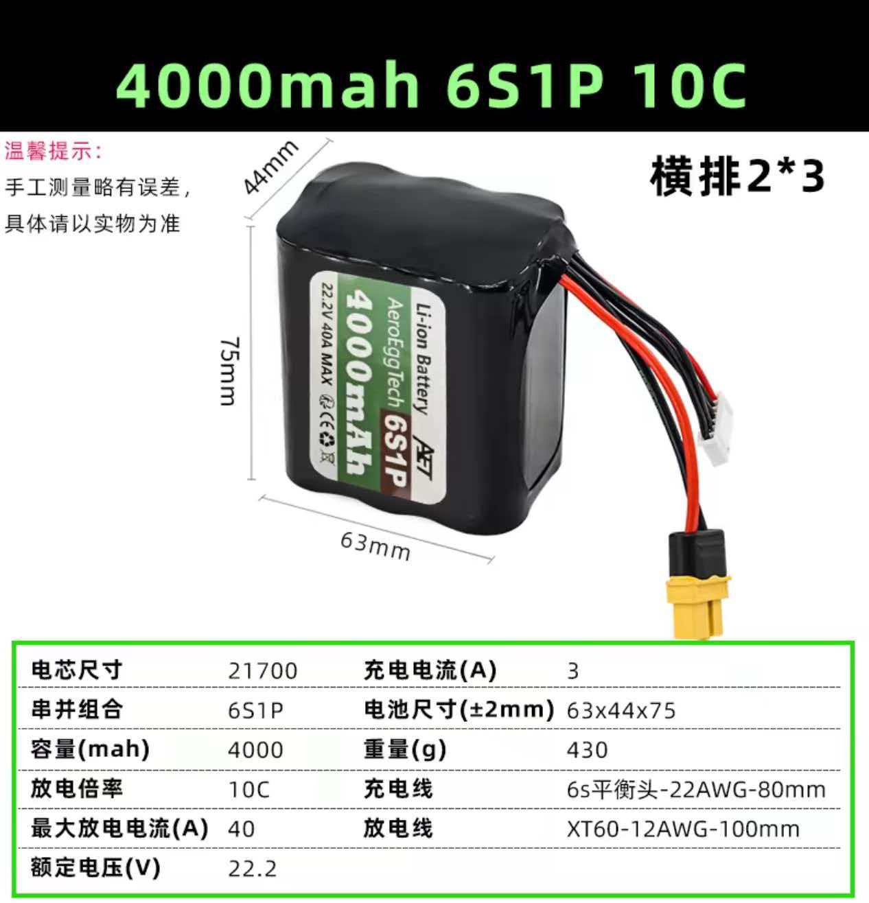
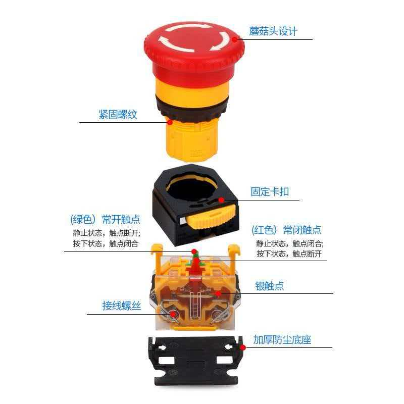

# Robogame计划书

# 队名介绍

本团队取名“少微摸个鱼”，名称巧用谐音与专业缩写，寓意深远：“少”与“微”分别代表了团队成员的背景——由来自**少年班学院**及来自**微电子学院**的同学跨学科组建而成。

虽名为“摸个鱼”，实则展现了我们在严谨的科研态度下，保持着松弛、灵动且富有想象力的创作心态。团队融合了少年班学子广博的数理底蕴与微电子专业扎实的硬件设计能力，在电控、机械、算法等多领域优势互补。我们致力于将天马行空的创意转化为稳健的机器人实体，在比赛中突破思维边界，用“灵机一动”的智慧去解决最硬核的技术挑战。

---

# 电路框图

---

# 主控系统

核心芯片：STM32F407

本机器人采用 **STM32F407VGT6** 作为底层核心处理器。该芯片基于高性能的 **ARM Cortex-M4** 内核，主频高达 168MHz，能够支撑起复杂的多传感器融合算法与实时 PID 运动控制。

- **高性能浮点运算：** 芯片内置 FPU（浮点运算单元），能够快速处理“垒高”过程中所需的传感器滤波算法及运动学反解，确保控制指令的毫秒级响应。
- **多路正交编码器接口：** 针对 MD36 电机的 500 线高精度编码器，STM32F407 硬件内置多路定时器支持正交解码模式，可直接硬件计数，不占用 CPU 资源，从根本上保证了高速移动时位置反馈不丢步。
- **丰富的总线接口：** 集成多路 CAN、UART 及 I2C 接口。除驱动 C50C 电机板外，还可同时挂载陀螺仪（IMU）、激光测距（ToF）等外设，具备极强的系统扩展性。

电机驱动板：C50C 有刷电机驱动

主控板配套使用 **C50C 高功率有刷电机驱动模块**，负责将单片机的逻辑信号转化为驱动 MD36 电机的动力电流。

- **全桥驱动架构：** 支持双路或四路电机控制，能够实现电机的正反转切换及线性调速。
- **高电流承载力：** C50C 针对机器人比赛设计，单路持续电流可承受 5A-10A，完美匹配 MD36 电机在举升重物时的瞬时负载需求。
- **完善的隔离机制：** 驱动板带有光耦隔离或逻辑电平转换设计，有效防止电机工作时的电刷火花及电磁尖峰反向冲击 STM32 主控芯片，保障系统长时间运行的稳定性。

控制逻辑设计

- **位置闭环（PID）：** 利用 STM32 采集编码器反馈，通过 PID 算法实时修正电机 PWM，实现方块堆叠时的厘米级定位。
- **安全监控：** 通过 ADC 接口实时监测电池电压，并在紧急情况下配合 **LA38P-11ZS** 急停开关锁定所有驱动输出。

---

# 电源

电源概述
本机器人选用**飞蛋科技 AeroEggTech 21700 锂电池（6S1P，10C）**作为核心动力源，该电池系列专为 FPV 穿越机与航模设计，具备稳定的持续放电能力与结构强度，适合机器人比赛中频繁启停、高强度运行的工况。

6S 配置下电池额定电压为 **22.2V**，满充电压为 **25.2V**，最大持续放电电流 **40A，**可直接匹配 MD36 行星减速电机的 **24V 供电档位**，无需额外升压，最大程度保留电能转化效率，并为 C50C 驱动板提供充裕的电压余量。同时也符合本次赛程最大电压不超过28V的要求。

相比传统 18650，21700 电芯单体容量更大、内阻更低，在同等体积下提供更强的持续放电能力，适合比赛中高功率频繁启停的场景。

电源参数参考表：

---

# 稳压与配电方案

设计思路
由于 MD36 电机在负载工作时会产生较大的反向电动势和电磁噪声，为保护 **STM32F407** 主控芯片及高分辨率 **GMR 编码器**，本系统采用“双路物理隔离”的配电架构，确保逻辑电路与动力电路互不干扰。**C50C 主控板由独立充电宝单独供电**，无需额外降压模块，简化了配电设计。

配电架构设计

- **动力直供回路（强电）：**
    - 电池能量经过 **LA38P-11ZS 急停开关**后，直接接入 **C50C 电机驱动板**（动力侧）。
    - 此路不经过任何降压模块，以保证电机在高强度抓取与举升时能获取电池的最大瞬时电流。
- **主控独立供电回路（弱电）：**
    - **C50C 主控板（STM32F407）**及编码器等逻辑器件由**充电宝**独立供电（标准 5V USB 输出）。
    - 与动力回路完全物理隔离，从根本上消除了电机启停时的电磁噪声对主控和编码器信号的干扰，无需额外降压模块。
- **外设辅助回路（可选）：**
    - 根据任务需求，可视情况从充电宝或动力电池侧引出辅助支路，供给 IMU 陀螺仪、激光测距等外设。
    - 实现模块化供电，避免不同外设间的电流波动互相牵扯。

抗干扰与保护措施

- **物理隔离：** 动力回路与逻辑回路由两套独立电源供电，彻底消除共地干扰。
- **防逆流设计：** 在驱动板输入端并联大电解电容，吸收电机刹车时的泵升电压，保护驱动板和主控系统。

---

# 电机

电机概述
本机器人执行系统全面采用 **MD36L 系列行星减速电机**。该电机集成了高功率密度直流有刷马达、多级行星减速器以及高分辨率编码器，是实现机器人精准位移与重物堆叠的核心组件。

核心选型优势

- **高分辨率 GMR 编码器（500线）**：相较于普通霍尔编码器，MD36 搭载的 500 线高精度编码器配合 STM32F407 的四倍频计数功能，单圈脉冲数可达 2000 个。
这为“垒高”任务提供了极高的垂直定位精度，有效避免方块在堆叠过程中出现累计误差导致的倾倒。
- **行星减速器特性**：行星齿轮结构具有多点受力、传动效率高、抗冲击性强的优点。
在搬运方块的过程中，能够提供比普通齿轮箱更平稳的转速输出，极大减小了机器人启停时的惯性震动。
- **负载匹配与低速稳定性**：该电机在低速运行（PWM 占空比低）时依然能保持稳定的扭矩输出，解决了传统有刷电机在微小位移时容易出现的“爬行”或“抖动”问题，保证了放下方块时的平稳释放。

任务分工方案

- **底盘驱动：** 选配 **1:14 或 1:19** 减速比规格，提供约 400-600 RPM 的额定转速，确保机器人能够快速往返于采集点与堆叠点之间。
- **提升机构：** 选配 **1:51 或以上** 大减速比规格。利用行星减速器的大扭矩特性负载方块重量，结合 F407 的 PID 位置闭环算法，实现精准的垂直高度控制。

电机参数参考表

# 安全防护与急停系统

急停开关选型：LA38P-11ZS

本机器人严格遵守赛事安全规范，在主电源回路中接入了 **LA38P-11ZS 工业级大电流急停开关**。作为系统安全的第一道防线，该开关具备“一拍即停、旋钮复位”的强制机械锁定功能。

功能特性

- **物理断电可靠性：** 选用的 LA38P 开关拥有高强度的银合金触点，具备极高的负载能力（标称 10A 以上）。在机器人发生程序跑飞、机械卡死或电池短路等紧急情况时，操作员按下红色蘑菇头即可瞬时物理切断主回路电流。
- **强制锁定机制：** 该开关采用自锁设计，一旦触发，必须手动旋转方可复位。这有效防止了在故障未排除的情况下，因误触导致的机器人二次启动，确保了现场调试人员的安全。
- **高辨识度设计：** 鲜红色的蘑菇头外形与黄色底座符合工业安全视觉标准，安装于机器人顶部的显著位置，确保在任何角度下均能快速触达。

连接逻辑

- **串联布置：** 急停开关串联在电池正极总输出线与分电板（或 C50C 驱动板）之间。
- **全机停力：** 触发急停后，动力回路（电机）将立即断电，而逻辑回路（STM32主控）可通过二极管隔离或独立备用电源保持短暂运行，以便记录故障发生时的传感器数据。

